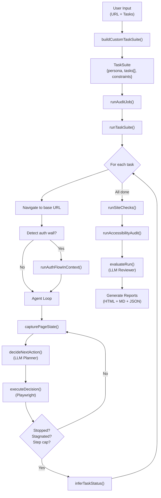
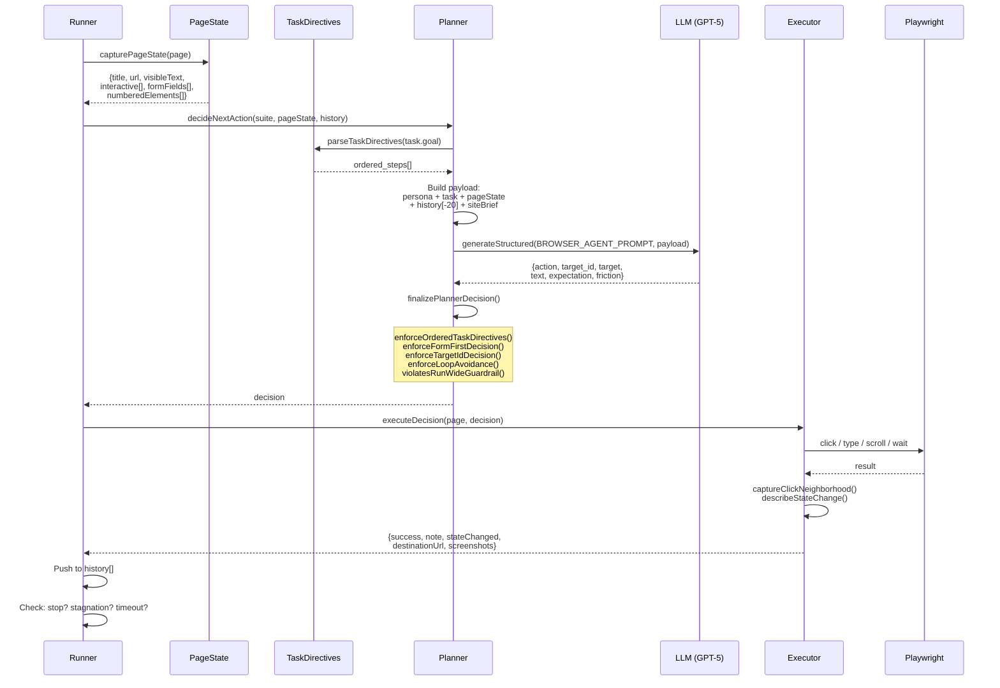
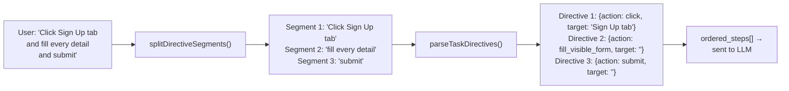
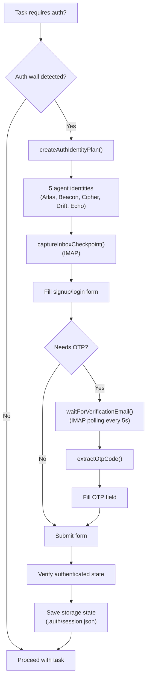
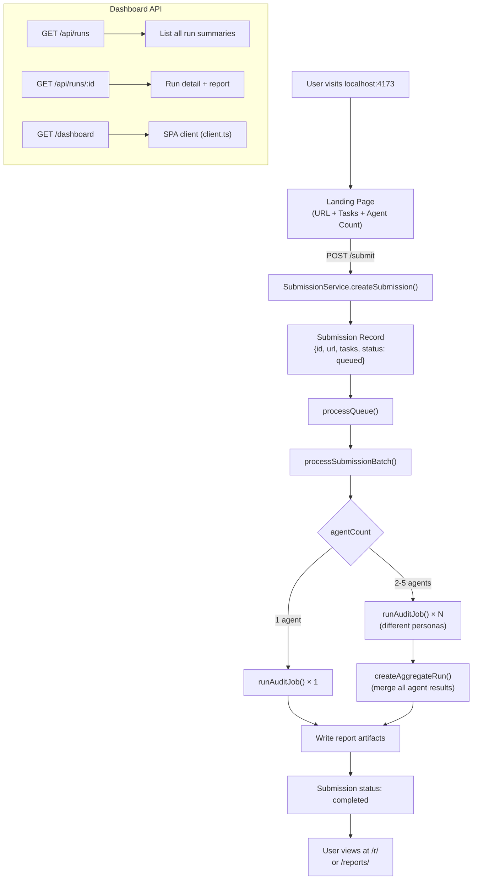
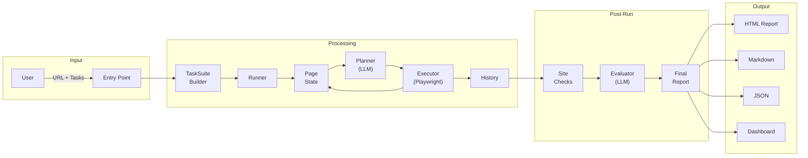

# Site Agent — Architecture Guide

> An AI-powered browser automation agent that executes user-defined tasks on websites, captures evidence of every interaction, and generates scored reports with actionable findings.

---

## Table of Contents

1. [System Overview](#system-overview)
2. [High-Level Architecture](#high-level-architecture)
3. [Entry Points](#entry-points)
4. [Core Execution Pipeline](#core-execution-pipeline)
5. [The Agent Brain — Planning Loop](#the-agent-brain--planning-loop)
6. [Task Directive Parsing](#task-directive-parsing)
7. [Browser Execution Engine](#browser-execution-engine)
8. [Authentication System](#authentication-system)
9. [Evaluation & Reporting](#evaluation--reporting)
10. [Site Checks & Audits](#site-checks--audits)
11. [Dashboard & Submissions](#dashboard--submissions)
12. [Deployment Modes](#deployment-modes)
13. [Directory Structure](#directory-structure)
14. [Data Flow Summary](#data-flow-summary)

---

## System Overview

Site Agent is a **browser automation system** that:

1. Accepts a **website URL** and a list of **user-defined tasks** (e.g., "Click the Sign Up Free tab and fill up every visible detail and submit")
2. Launches a **Playwright-controlled Chromium browser**
3. Uses an **LLM (GPT-5 or Ollama)** to plan each action step-by-step based on the live page state
4. **Executes** each action (click, type, scroll, etc.) against the real browser
5. Captures **screenshots**, **page state**, and **interaction history** as evidence
6. Runs **supplemental site checks** (SEO, performance, security, accessibility)
7. Generates a **scored report** (1-10) with strengths, weaknesses, and fix recommendations
8. Serves reports via a **web dashboard** or exports as HTML/Markdown/JSON

---

## High-Level Architecture

```
┌─────────────────────────────────────────────────────────────────────┐
│                         ENTRY POINTS                                │
│  ┌──────────┐  ┌──────────────────┐  ┌───────────────────────────┐  │
│  │  CLI      │  │  Dashboard Web   │  │  Netlify Serverless       │  │
│  │ cli/run   │  │  dashboard/      │  │  netlify/functions/       │  │
│  └─────┬─────┘  └────────┬─────────┘  └────────────┬──────────────┘  │
│        │                 │                          │                │
│        └─────────────────┼──────────────────────────┘                │
│                          ▼                                          │
│               ┌─────────────────────┐                               │
│               │   Submission Queue   │                               │
│               │   submissions/       │                               │
│               └──────────┬──────────┘                               │
│                          ▼                                          │
│  ┌──────────────────────────────────────────────────────────────┐   │
│  │                    ORCHESTRATION LAYER                        │   │
│  │  ┌────────────────┐   ┌──────────────────────────────────┐   │   │
│  │  │  runAuditJob    │   │  processSubmissionBatch           │   │   │
│  │  │  (single run)   │   │  (multi-agent panel, 1-5 agents) │   │   │
│  │  └───────┬────────┘   └──────────────┬───────────────────┘   │   │
│  │          │                           │                       │   │
│  │          └───────────┬───────────────┘                       │   │
│  │                      ▼                                       │   │
│  │  ┌──────────────────────────────────────────────────────┐    │   │
│  │  │              BROWSER EXECUTION ENGINE                 │    │   │
│  │  │                   runner.ts                           │    │   │
│  │  │  ┌─────────────────────────────────────────────────┐  │    │   │
│  │  │  │  For each task in TaskSuite:                     │  │    │   │
│  │  │  │    1. Navigate to base URL                       │  │    │   │
│  │  │  │    2. Capture page state                         │  │    │   │
│  │  │  │    3. ┌──────────── AGENT LOOP ──────────────┐   │  │    │   │
│  │  │  │       │  pageState.ts  → capture DOM snapshot │   │  │    │   │
│  │  │  │       │  planner.ts    → LLM decides action   │   │  │    │   │
│  │  │  │       │  executor.ts   → Playwright executes  │   │  │    │   │
│  │  │  │       │  ← repeat until stop/stagnation/cap → │   │  │    │   │
│  │  │  │       └──────────────────────────────────────┘   │  │    │   │
│  │  │  │    4. Infer task status (success/partial/fail)   │  │    │   │
│  │  │  └─────────────────────────────────────────────────┘  │    │   │
│  │  │  5. Run site checks (SEO, perf, security, a11y)       │    │   │
│  │  └──────────────────────────────────────────────────────┘    │   │
│  │                      │                                       │   │
│  │                      ▼                                       │   │
│  │  ┌──────────────────────────────────────────────────────┐    │   │
│  │  │              EVALUATION & REPORTING                   │    │   │
│  │  │  evaluator.ts → LLM scores the run (1-10)            │    │   │
│  │  │  reporting/   → HTML, Markdown, JSON reports          │    │   │
│  │  │  aggregateReport.ts → merges multi-agent results      │    │   │
│  │  └──────────────────────────────────────────────────────┘    │   │
│  └──────────────────────────────────────────────────────────────┘   │
└─────────────────────────────────────────────────────────────────────┘
```

---

## Entry Points

The system has **three ways to start a run**:

### 1. CLI (`src/cli/run.ts`)

```bash
npx site-agent-pro --url https://example.com --task "Click the pricing tab"
```

- Parses CLI flags via `commander`
- Builds a `TaskSuite` from `--task` arguments
- Optionally runs auth bootstrap (`--auth-flow` / `--auth-only`)
- Calls `runAuditJob()` directly

### 2. Web Dashboard (`src/dashboard/server.ts`)

- HTTP server on `localhost:4173`
- Landing page with a form: URL + task instructions + agent count (1-5)
- POST `/submit` → creates a `Submission` record → queues it
- `SubmissionService` processes the queue serially
- Serves reports at `/r/<token>` and `/reports/<runId>`
- REST API at `/api/runs` and `/api/runs/<id>`

### 3. Netlify Serverless (`src/netlify/`)

- Deploys as Netlify Functions for cloud hosting
- Same core logic, using `@sparticuz/chromium` for serverless browser
- Netlify-specific dashboard and storage adapters

---

## Core Execution Pipeline



---

## The Agent Brain — Planning Loop

This is the heart of the system. Each step in the agent loop works as follows:



### Planning Enforcement Chain

After the LLM returns its raw decision, it passes through **5 enforcement layers**:

```
LLM Raw Decision
       │
       ▼
┌─────────────────────────────────┐
│ enforceOrderedTaskDirectives()  │  Forces strict sequence from parsed user instructions
├─────────────────────────────────┤
│ enforceFormFirstDecision()      │  Auto-fills pending form fields (unless user directive pending)
├─────────────────────────────────┤
│ enforceTargetIdDecision()       │  Validates target_id exists in numberedElements
├─────────────────────────────────┤
│ enforceLoopAvoidance()          │  Prevents repeating failed actions
├─────────────────────────────────┤
│ violatesRunWideGuardrail()      │  Blocks actions violating persona.constraints
└─────────────────────────────────┘
       │
       ▼
  Final Decision → Executor
```

---

## Task Directive Parsing

User instructions are parsed into structured directives before being sent to the LLM:



**Supported directive types:**
`click` · `type_field` · `fill_visible_form` · `submit` · `scroll` · `wait` · `back` · `unstructured`

**Confidence signal:** If any segment can't be regex-matched, it becomes `unstructured` and `ordered_step_confidence` is set to `"low"`, telling the LLM to prefer `original_instruction` over `ordered_steps`.

---

## Browser Execution Engine

### Page State Capture (`pageState.ts`)

On every step, the agent snapshots the live DOM:

| Captured Data | Limit | Purpose |
|---|---|---|
| `visibleText` | 4,200 chars | Contextual awareness |
| `visibleLines` | 140 lines | Structured page reading |
| `interactive[]` | 60 elements | Clickable buttons, links, tabs |
| `formFields[]` | 30 fields | Input fields with labels, types, values |
| `numberedElements[]` | Combined | Agent's numbered element map for targeting |
| `headings[]` | 16 | Page structure awareness |
| `modalHints[]` | 4 | Dialog/modal detection |

Each interactive element gets a `data-site-agent-id` attribute for precise targeting.

### Action Execution (`executor.ts`)

| Action | What Happens |
|---|---|
| `click` | Locates element by agent ID → prepares locator → captures neighborhood before → clicks → waits → captures neighborhood after → determines state change |
| `type` | Locates field → clears existing value → types character by character (human-like) |
| `scroll` | Scrolls viewport in specified direction |
| `wait` | Pauses for page transitions |
| `extract` | Captures visible text evidence |
| `stop` | Ends the current task |

### State Change Detection

A click is considered successful if **any** of these changed:
- Page URL
- Page title
- Body text (first 800 chars)
- **Click neighborhood** (innerHTML of nearest semantic container — detects accordion/tab/modal changes)

---

## Authentication System



### Agent Identity System

Each agent slot has a hardcoded persona:

| Slot | Name | Email Pattern |
|---|---|---|
| 1 | Atlas Sentinel | `agentprobe-atlas+<seed>@domain.com` |
| 2 | Beacon Sentinel | `agentprobe-beacon+<seed>@domain.com` |
| 3 | Cipher Sentinel | `agentprobe-cipher+<seed>@domain.com` |
| 4 | Drift Sentinel | `agentprobe-drift+<seed>@domain.com` |
| 5 | Echo Sentinel | `agentprobe-echo+<seed>@domain.com` |

Failed signups automatically retry with variant emails (`+siteagent-<seed>-<attempt>`) and phone numbers.

---

## Evaluation & Reporting

### LLM Evaluation (`evaluator.ts`)

After all tasks complete, the full interaction history is sent to the LLM via the `REVIEWER_PROMPT`:

```
Task results + raw events + accessibility data + site brief
                    │
                    ▼
         LLM (Reviewer Persona)
                    │
                    ▼
┌────────────────────────────────────┐
│  FinalReport                       │
│  ├─ overall_score: 1-10            │
│  ├─ summary: string                │
│  ├─ scores:                        │
│  │   ├─ clarity                    │
│  │   ├─ navigation                 │
│  │   ├─ trust                      │
│  │   ├─ friction                   │
│  │   ├─ conversion_readiness       │
│  │   └─ accessibility_basics       │
│  ├─ strengths: string[]            │
│  ├─ weaknesses: string[]           │
│  ├─ task_results: TaskResult[]     │
│  ├─ top_fixes: string[]            │
│  └─ gameplay_summary?: object      │
└────────────────────────────────────┘
```

### Multi-Agent Aggregation (`aggregateReport.ts`)

When running 2-5 agents (via dashboard), results are merged:
- Scores are **averaged** across agents
- Strengths/weaknesses are **ranked by frequency**
- Task statuses use **consensus logic** (all success → success, all fail → fail, mixed → partial)
- Accessibility violations are **deduplicated and merged**

### Report Outputs

Each run produces these artifacts in `data/runs/<runId>/`:

| File | Format | Content |
|---|---|---|
| `inputs.json` | JSON | Run configuration and parameters |
| `raw-events.json` | JSON | Every console log, network event, interaction |
| `task-results.json` | JSON | Per-task history with every step |
| `accessibility.json` | JSON | axe-core violations |
| `site-checks.json` | JSON | SEO, performance, security, content checks |
| `report.json` | JSON | Final scored report |
| `report.html` | HTML | Standalone shareable report |
| `report.md` | Markdown | Text report |
| `task-*-step-*-before.png` | PNG | Pre-click screenshots |
| `task-*-step-*-after.png` | PNG | Post-click screenshots |
| `click-replay.html` | HTML | Animated click replay visualization |

---

## Site Checks & Audits

### `siteChecks.ts` — Supplemental Quality Checks

Run after all tasks complete (within remaining time budget):

```
┌─────────────────────────────────────────────┐
│  Site Checks Coverage                        │
├──────────────────────┬──────────────────────┤
│  Performance         │  Page load metrics,   │
│                      │  failed requests,     │
│                      │  image/API failures   │
├──────────────────────┼──────────────────────┤
│  SEO                 │  robots.txt,          │
│                      │  sitemap.xml,         │
│                      │  broken link scan     │
├──────────────────────┼──────────────────────┤
│  Security            │  HTTPS, headers       │
│                      │  (CSP, HSTS, etc.)    │
├──────────────────────┼──────────────────────┤
│  Technical Health    │  Framework detection, │
│                      │  console errors,      │
│                      │  page errors          │
├──────────────────────┼──────────────────────┤
│  Mobile              │  Responsive design    │
│                      │  viewport comparison  │
├──────────────────────┼──────────────────────┤
│  Content Quality     │  Readability score,   │
│                      │  word count, media    │
├──────────────────────┼──────────────────────┤
│  CRO                 │  CTA count, forms,    │
│                      │  trust signals        │
├──────────────────────┼──────────────────────┤
│  Accessibility       │  axe-core audit       │
│                      │  (WCAG violations)    │
└──────────────────────┴──────────────────────┘
```

---

## Dashboard & Submissions



### Submission Lifecycle

```
queued → running → completed
                 → failed
```

- Up to **5 concurrent agent perspectives** per submission
- Each agent gets a different **persona variant** (different identity, same task)
- Results are aggregated into a single merged report
- Reports have a **TTL** (default 30 days) after which public links expire

---

## Deployment Modes

| Mode | Entry | Browser | Storage |
|---|---|---|---|
| **CLI** | `cli/run.ts` | System Playwright Chromium | Local filesystem |
| **Dashboard** | `dashboard/server.ts` | System Playwright Chromium | Local `data/` directory |
| **Netlify** | `netlify/functions/` | `@sparticuz/chromium` (serverless) | Netlify Blobs |

---

## Directory Structure

```
src/
├── cli/                    # Command-line interface
│   ├── run.ts              #   Main CLI entry point (commander)
│   └── backfillSiteChecks  #   Retroactive site check tool
│
├── core/                   # Core automation engine
│   ├── runner.ts           #   Main execution loop (runTaskSuite)
│   ├── planner.ts          #   LLM-powered action planning
│   ├── executor.ts         #   Playwright action execution
│   ├── pageState.ts        #   DOM snapshot capture
│   ├── taskDirectives.ts   #   User instruction parsing
│   ├── taskHeuristics.ts   #   Task classification & scoring
│   ├── customTaskSuite.ts  #   TaskSuite builder from user input
│   ├── evaluator.ts        #   LLM-powered run evaluation
│   ├── runAuditJob.ts      #   Single-run orchestrator
│   ├── processSubmissionBatch.ts  # Multi-agent orchestrator
│   ├── aggregateReport.ts  #   Multi-agent result merger
│   ├── siteBrief.ts        #   LLM site comprehension
│   ├── siteChecks.ts       #   SEO/perf/security/a11y checks
│   ├── audit.ts            #   axe-core accessibility wrapper
│   ├── formHeuristics.ts   #   Form field matching logic
│   ├── interaction.ts      #   Low-level Playwright helpers
│   ├── gameplaySummary.ts  #   Game/interactive task tracking
│   ├── agentProfiles.ts    #   Agent persona variants
│   └── fallbackReport.ts   #   Deterministic report fallback
│
├── auth/                   # Authentication system
│   ├── profile.ts          #   Agent identity management
│   ├── inbox.ts            #   IMAP email polling for OTP
│   └── runner.ts           #   Full signup/login/OTP flow
│
├── prompts/                # LLM system prompts
│   ├── browserAgent.ts     #   Action planning prompt
│   └── reviewer.ts         #   Report evaluation prompt
│
├── llm/                    # LLM client abstraction
│   └── client.ts           #   OpenAI + Ollama structured output
│
├── schemas/                # Zod schemas & TypeScript types
│   └── types.ts            #   Shared type definitions
│
├── reporting/              # Report generation
│   ├── html.ts             #   Standalone HTML report renderer
│   ├── markdown.ts         #   Markdown report renderer
│   ├── template.ts         #   HTML template engine
│   └── clickReplay.ts      #   Animated click replay generator
│
├── submissions/            # Submission management
│   ├── service.ts          #   Queue-based submission processor
│   ├── store.ts            #   JSON file-based persistence
│   ├── types.ts            #   Submission Zod schemas
│   ├── model.ts            #   Submission record factory
│   ├── customTasks.ts      #   Task normalization
│   ├── publicUrl.ts        #   URL validation
│   └── html.ts             #   Submission status pages
│
├── dashboard/              # Web dashboard
│   ├── server.ts           #   HTTP server + routing
│   ├── client.ts           #   Frontend SPA (vanilla JS)
│   ├── narrative.ts        #   Report narrative renderer
│   ├── theme.ts            #   CSS design system
│   └── contracts.ts        #   API response types
│
├── backend/                # Backend data layer
│   ├── dashboardData.ts    #   Run summary/detail builders
│   ├── runRepository.ts    #   File-based run storage
│   └── runArtifacts.ts     #   Artifact file handling
│
├── netlify/                # Serverless deployment
│   ├── app.ts              #   Netlify app config
│   ├── dashboard.ts        #   Netlify dashboard adapter
│   ├── storage.ts          #   Netlify Blobs storage
│   └── functions/          #   Lambda function handlers
│
├── utils/                  # Shared utilities
│   ├── files.ts            #   File I/O helpers
│   ├── log.ts              #   Logging
│   ├── time.ts             #   Sleep/timing
│   └── playwrightCompat.ts #   Browser compatibility shims
│
└── config.ts               # Environment configuration
```

---

## Data Flow Summary



### Key Configuration (`config.ts`)

| Setting | Default | Purpose |
|---|---|---|
| `LLM_PROVIDER` | `openai` | LLM backend (`openai` or `ollama`) |
| `OPENAI_MODEL` | `gpt-5` | Model for planning & evaluation |
| `MAX_SESSION_DURATION_MS` | `600000` (10 min) | Total run time budget |
| `MAX_STEPS_PER_TASK` | `32` | Maximum actions per task |
| `ACTION_DELAY_MS` | `600` | Pause between actions (human-like) |
| `NAVIGATION_TIMEOUT_MS` | `25000` | Page load timeout |
| `REPORT_TTL_DAYS` | `30` | Public report link expiry |

### Time Budget Allocation

```
Total Run: 600s (10 minutes)
├── Browser Execution:  ~510s (85%)
│   ├── Per-task step loop
│   ├── Auth bootstrap (if needed)
│   └── Site checks reserve: 45s
└── Reporting Reserve:   ~90s (15%)
    ├── LLM evaluation
    └── Report generation
```
